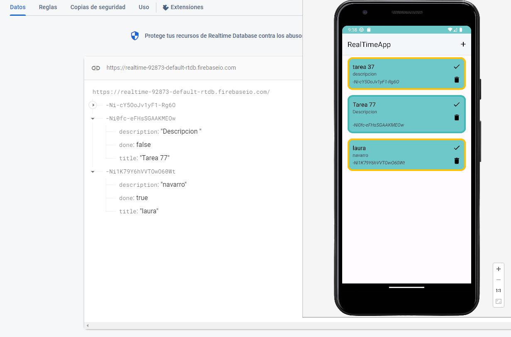
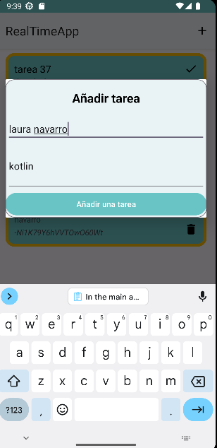
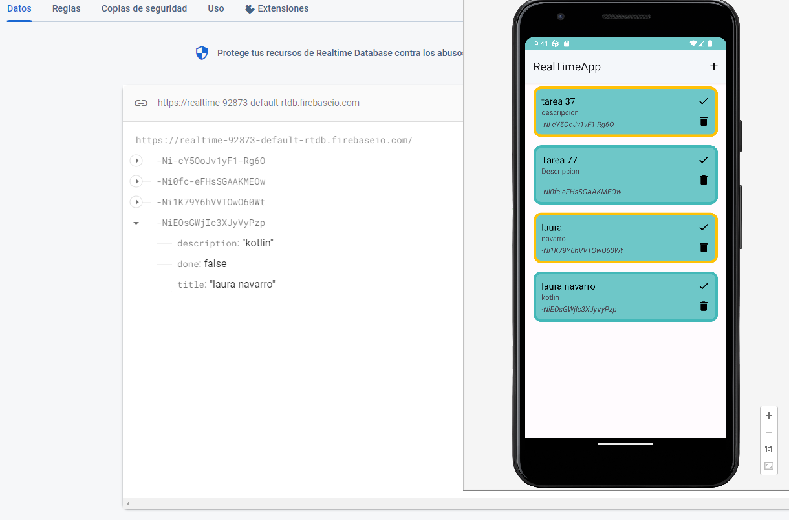
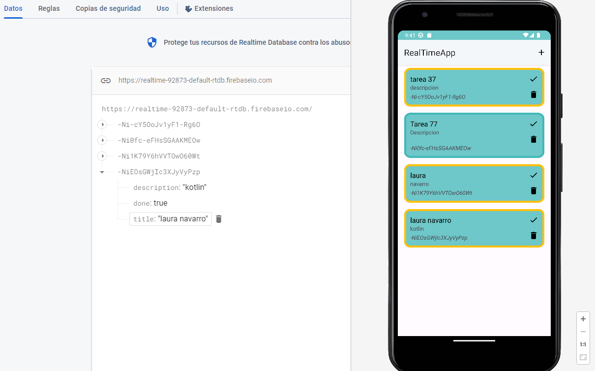

# App RealTime Database with Firebase🔥

* [Firebase](https://firebase.google.com/?hl=es)

## On the main page we have a list of characters with their respective name and house through a recycler view.

 

## now let's add a task
 

## we can see how it is also added in our firebase
 

## We can also check it and a golden border will appear or delete it and it will disappear from our list

 

